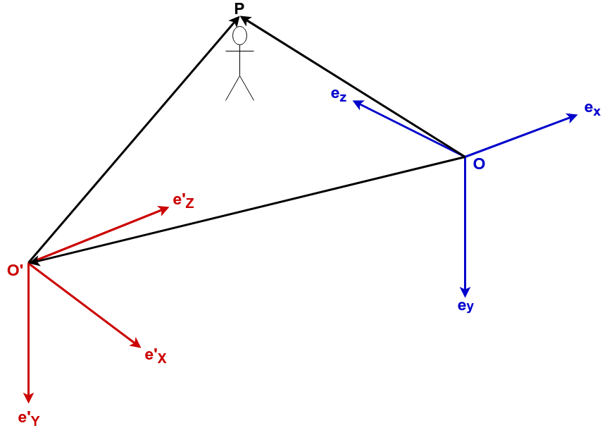

カメラ座標系とワールド座標系の変換
==================================

$$
\newcommand{\E}{\mathbf{e}}
$$

# やること

[OpenCVのDocumentation](https://docs.opencv.org/2.4/modules/calib3d/doc/camera_calibration_and_3d_reconstruction.html)にある，ワールド座標系とカメラ座標系の間の変換

$$
\begin{equation} \label{eq1} \tag{1}
\begin{bmatrix}
    x \\ y \\ z
\end{bmatrix} =
R
\begin{bmatrix}
    X \\ Y \\ Z
\end{bmatrix}
+
\mathbf{t}
\end{equation}
$$

はぱっと見ただけではわかりづらいので，ワールド座標系とカメラ座標系をしっかりと定め，その間の変換(式\\(\ref{eq1}\\))を導出します．

# 座標系の定義

ここでは原点\\(O\\)，基底\\(\E_x, \E_y, \E_z\\)から成る直交座標系を\\(O[\E_x, \E_y, \E_z]\\)と表記することにします．

また，ワールド座標系とカメラ座標系をそれぞれ次のように設定します．  

|                                          |                               |
|:-----------------------------------------|:------------------------------|
| 原点を\\(O'\\)としたときのワールド座標系 | \\(O'[\E'_X, \E'_Y, \E'_Z]\\) | 
| 位置\\(O\\)のカメラの座標系              | \\(O[\E_x, \E_y, \E_z]\\)     |

# それぞれの座標系での物体座標の記述
カメラに映っている物体の座標を\\(P\\)とし，これをそれぞれの座標系で表現すると

$$
\begin{align*}
\vec{O'P} 
&= X\E'_X + Y\E'_Y + Z\E'_Z \\
&=
\begin{bmatrix}
    \E'_X & \E'_Y & \E'_Z
\end{bmatrix}
\begin{bmatrix}
    X \\ Y \\ Z
\end{bmatrix}
\\
\vec{OP} 
&= x\E_x + y\E_y + z\E_z \\
&=
\begin{bmatrix}
    \E_x & \E_y & \E_z 
\end{bmatrix}
\begin{bmatrix}
    x \\ y \\ z
\end{bmatrix}
\end{align*}
$$

となります．

ベクトル\\(\vec{OO'}\\)をカメラ座標系\\(O[\E_x, \E_y, \E_z]\\)で表現すると

$$
\begin{align*}
\vec{OO'} 
&= t_x \E_x + t_y \E_y + t_z \E_z \\
&=
\begin{bmatrix}
    \E_x & \E_y & \E_z
\end{bmatrix}
\begin{bmatrix}
    t_x \\ t_y \\ t_z 
\end{bmatrix}
\end{align*}
$$

また，\\(\vec{OP} = \vec{OO'} + \vec{O'P}\\)より，

$$
\begin{equation} \label{eq2} \tag{2}
\begin{bmatrix}
    \E_x & \E_y & \E_z 
\end{bmatrix}
\begin{bmatrix}
    x \\ y \\ z
\end{bmatrix} =
\begin{bmatrix}
    \E'_X & \E'_Y & \E'_Z
\end{bmatrix}
\begin{bmatrix}
    X \\ Y \\ Z
\end{bmatrix}
+
\begin{bmatrix}
    \E_x & \E_y & \E_z
\end{bmatrix}
\begin{bmatrix}
    t_x \\ t_y \\ t_z
\end{bmatrix} 
\end{equation}
$$

と書けます．

# 座標系の変換

ワールド座標系\\(O'[\E'_X, \E'_Y, \E'_Z]\\)とカメラ座標系\\(O[\E_x, \E_y, \E_z]\\)はそれぞれ別々の座標系ではあるものの，どちらも同じ3次元空間に共存しており，かつ直交座標系であるため，片方の基底を用いてもう片方の基底を表現することができます．

この変換を回転行列\\(R \in \mathbb{R}^{3 \times 3}\\)を用いて 

$$
\begin{bmatrix}
    \E'_X & \E'_Y & \E'_Z
\end{bmatrix} =
\begin{bmatrix}
    \E_x & \E_y & \E_z
\end{bmatrix} R
$$

と表記すると，式\\(\ref{eq2}\\)は

$$
\begin{equation}
\begin{bmatrix}
    \E_x & \E_y & \E_z 
\end{bmatrix}
\begin{bmatrix}
    x \\ y \\ z
\end{bmatrix} =
\begin{bmatrix}
    \E_x & \E_y & \E_z
\end{bmatrix} R
\begin{bmatrix}
    X \\ Y \\ Z
\end{bmatrix}
+
\begin{bmatrix}
    \E_x & \E_y & \E_z
\end{bmatrix}
\begin{bmatrix}
    t_x \\ t_y \\ t_z
\end{bmatrix} 
\end{equation}
$$

と書き換えることができます．  
両辺から基底部分を取り除くと

$$
\begin{equation} 
\begin{bmatrix}
    x \\ y \\ z
\end{bmatrix} =
R
\begin{bmatrix}
    X \\ Y \\ Z
\end{bmatrix}
+
\begin{bmatrix}
    t_x \\ t_y \\ t_z
\end{bmatrix} 
\end{equation}
$$
.

さらに

$$
\mathbf{t} = 
\begin{bmatrix}
    t_x \\ t_y \\ t_z
\end{bmatrix} 
$$

とおけば，

$$
\begin{equation} 
\begin{bmatrix}
    x \\ y \\ z
\end{bmatrix} =
R
\begin{bmatrix}
    X \\ Y \\ Z
\end{bmatrix}
+
\mathbf{t}
\end{equation}
$$

というふうに座標変換を記述することができます．
