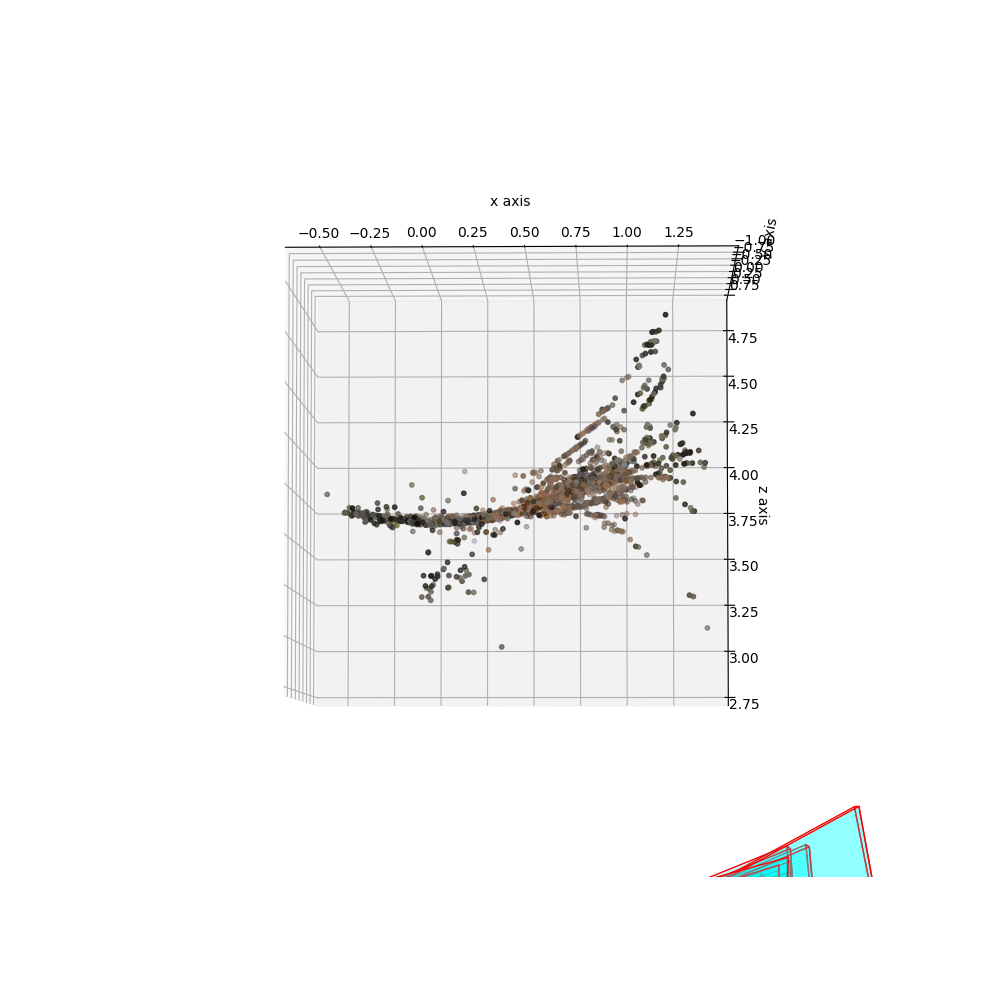
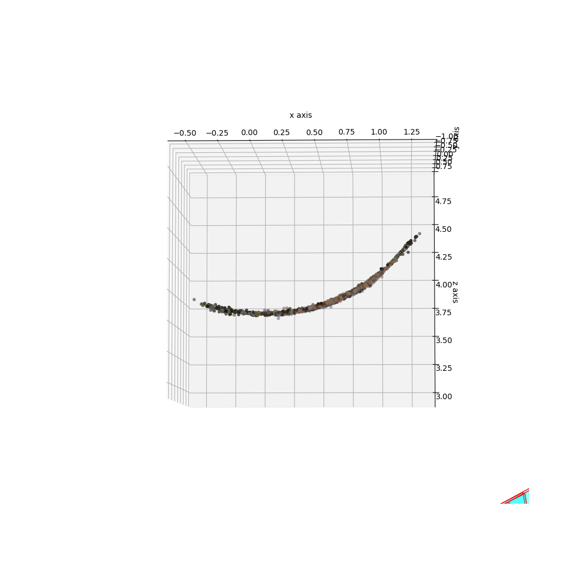
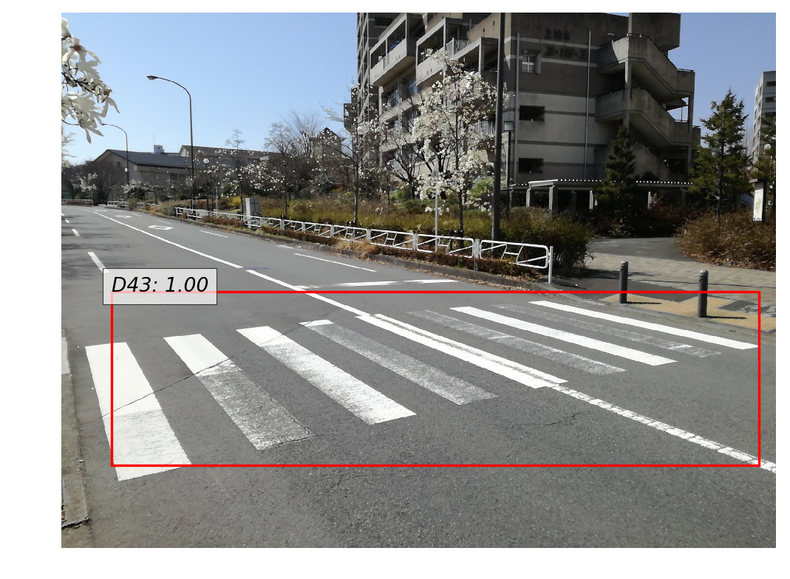
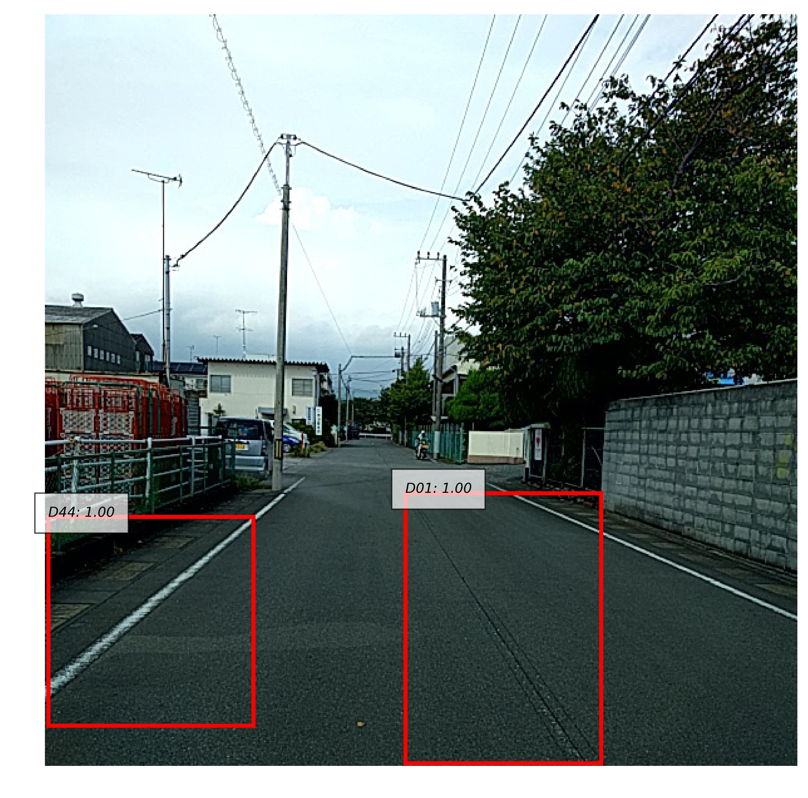
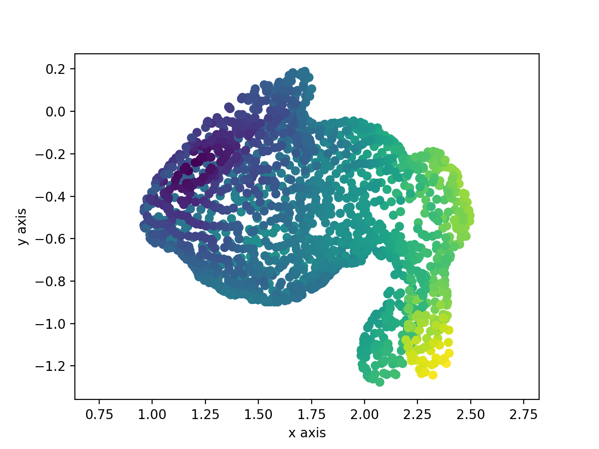
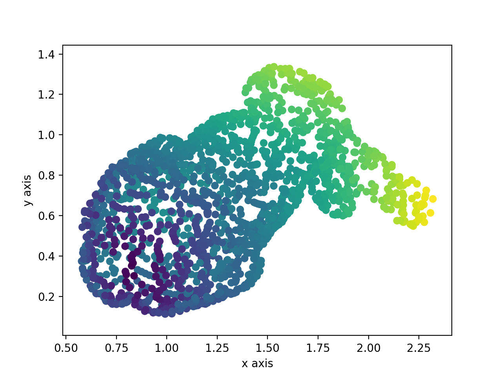
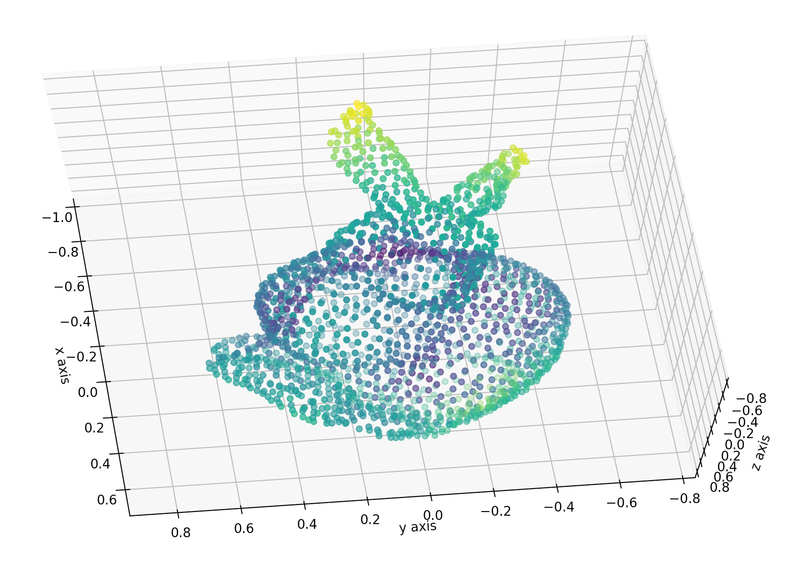
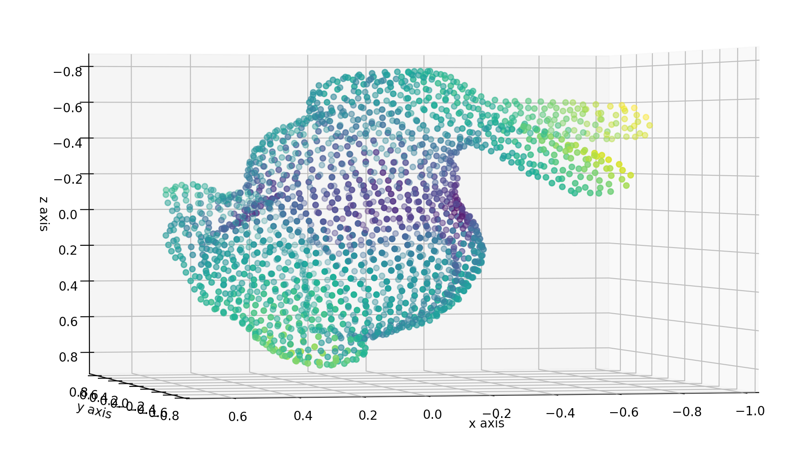
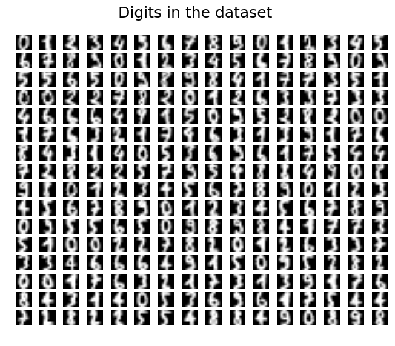
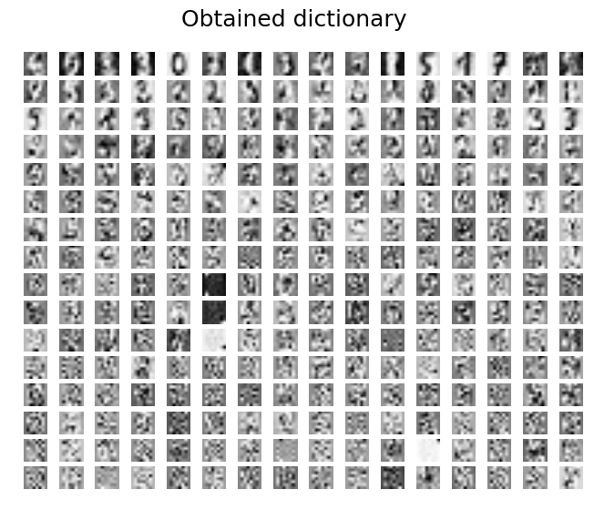

=========
石田 岳志
=========

職歴
====

| `未踏プロジェクト <https://www.ipa.go.jp/jinzai/mitou/2019/gaiyou_s-2.html>`__
| Visual SLAMフレームワークの開発
| 2019年4月 - 2020年3月

| `株式会社ディー・エヌ・エー <https://dena.com/>`__
| コンピュータビジョンに関連する手法の調査と実装
| 2017年4月 - 2020年3月
| アルバイト

| `クックパッド株式会社 <https://info.cookpad.com>`__
| 料理画像から具材を推定する手法の開発
| 2016年12月 - 2017年7月
| アルバイト

| `株式会社ウサギィ <http://usagee.co.jp/>`__
| コンピュータビジョンや自然言語処理におけるさまざまな手法の調査と実装
| 2014年5月 - 2017年1月
| アルバイト

学歴
====

| 東京高専 専攻科 機械情報システム工学専攻
| 2017年4月 - 2019年3月

| フィンランド メトロポリア応用科学大学 (交換留学)
| 2018年8月 - 2018年12月

| 東京高専 情報工学科
| 2012年4月 - 2017年3月

成果物一覧
==========

主な成果物はここにまとまっている

- `GitHub       <https://github.com/IshitaTakeshi>`__
- `Blog         <https://ishitatakeshi.netlify.com>`__
- `Qiita        <https://qiita.com/IshitaTakeshi>`__
- `SpeakerDeck  <https://speakerdeck.com/ishitatakeshi>`__

ソフトウェア
------------

`Tadataka <https://github.com/IshitaTakeshi/Tadataka>`__
~~~~~~~~~~~~~~~~~~~~~~~~~~~~~~~~~~~~~~~~~~~~~~~~~~~~~~~~

| 　Visual SLAMの研究開発と産業応用を促進するために開発しているフレームワークである．
| 　現在ではDVOと特徴点ベースのVisual Odometryを使うことができる．

**DVO (Dense Visual Odometry)** [#Steinbrucker_et_al_2011]_ [#Kerl_et_al_2013]_

| 　深度情報および画像の輝度情報からカメラの移動経路を推定することができる．
| 　私のブログに `手法の詳細な解説 <https://ishitatakeshi.netlify.com/dvo.html>`__ が書かれている．

.. raw:: html

    <iframe width="560" height="315" src="https://www.youtube.com/embed/oDgBgdHUwOM" frameborder="0" allow="accelerometer; autoplay; encrypted-media; gyroscope; picture-in-picture" allowfullscreen></iframe>

**特徴点ベースのVisual Odometry**

　単眼RGB画像列のみから3次元地図とカメラの軌跡を推定することができる.

.. raw:: html

    <iframe width="560" height="315" src="https://www.youtube.com/embed/h4KrMJQDoX4" frameborder="0" allow="accelerometer; autoplay; encrypted-media; gyroscope; picture-in-picture" allowfullscreen></iframe>

**プロジェクトの目的**

　既存のVisual SLAMの実装には次のような問題が存在する．

- 手法ごとに実装が独立している
- 十分にモジュール化されていない
- デバッグがしづらい

　これらの問題はVisual SLAMの研究開発や産業応用を妨げている．私は，使いやすく，拡張しやすいVisual SLAMフレームワーク "Tadataka" を開発することで，Visual SLAMの研究が促進され，さまざまな製品に応用されることを期待している．

**手法ごとに実装が独立している**

　Visual SLAMにはさまざまな手法が存在する．Visual SLAMのアプリケーションを作成する際には，複数の手法の中から自分が作りたいアプリケーションに最も適したものを選ぶ必要がある．しかしながら，手法ごとに実装が独立しており，ビルド方法や実行方法がそれぞれ異なるため，アプリケーションに合った手法を選ぶのに手間がかかる．

**十分にモジュール化されていない**

　Visual SLAMの実装の多くは十分にモジュール化されていないため，コードを再利用したり拡張したりすることが難しい．

**デバッグがしづらい**

　Visual SLAMを動作させると，カメラ姿勢を正しく推定できなかったり，地図をうまく作れないということが起こり得る．これらがうまくいかない際には，入力されたデータや処理内容を確認し，どこに原因があるのかを突き止める必要がある．原因を迅速に把握するためには，コードが十分にモジュール化されていることが望ましい．しかしながら，現状のVisual SLAMの実装の多くはモジュール化が十分になされていないため，処理に失敗したときにその原因を探ることが難しい．

**Visual SLAMフレームワーク**

| 　こういった問題点を解消するため，私は複数の手法を統一的に扱うことができる，高い拡張性をもったVisual SLAMフレームワークTadatakaを開発している．
| 　たとえば機械学習ライブラリのsckit-learnを用いると `SVM` を `RandomForest` と書き換えるだけで中身が全く異なる別々の手法を切り替えることができる．同様に，Tadatakaでは， `LsdSlam` を `OrbSlam` に書き換えるだけで全く異なる手法を切り替えられることを目指している．
| 　各種のDeep Learningフレームワークを用いると，1行書き換えるだけで異なる活性化関数を使うことができる．Visual SLAMをニューラルネットほど高度にモジュール化することは難しいが，Tadatakaでは内部を極力モジュール化し，コードの再利用性と拡張性を高めている．1行書き換えるだけで異なる画像特徴量を使えること，1行書き換えるだけで異なる測光誤差関数を使えることを目指している．

`SBA (Sparse Bundle Adjustment) <https://github.com/IshitaTakeshi/SBA>`__
~~~~~~~~~~~~~~~~~~~~~~~~~~~~~~~~~~~~~~~~~~~~~~~~~~~~~~~~~~~~~~~~~~~~~~~~~

.. _sba_sabacan:
.. table:: 図は円筒の復元結果を上から見たものである．左側がBundle Adjusmentを適用せずに復元した結果であり，右側がBundle Adjustmentを適用しながら復元した結果である．左側は完全に地図が破綻しているのに対して右側は弧が正しく復元できていることがわかる．

    +--------+--------+
    | |sba1| | |sba2| |
    +--------+--------+

| 　Visual Odometryは動作過程で地図やカメラ姿勢に誤差が蓄積していってしまう．この誤差を取り除く操作がBundle Adjustmentである (:numref:`sba_sabacan`)．
| 　Bundle Adjustmentは再投影誤差を誤差の指標とし，これが最小になるような3次元点群座標とカメラ姿勢を求める問題である．
| 　Bundle Adjustmentでは，LM法(あるいはGauss-Newton法)によって再投影誤差を最小化する3次元点群座標とカメラ姿勢を探索する．LM法の更新過程では誤差関数のHessianの逆行列が要求されるが，3次元復元ではHessianが非常に巨大になり，逆行列計算のコストが爆発してしまうという問題がある．
| 　SBA [#Lourakis_et_al_2009]_ は誤差関数のJacobianのスパース性に着目し，Hessianの逆行列の計算コストを大幅に減少させた手法である．私はこれを実装し，Pythonパッケージとして公開した．また， `第54回CV勉強会 <https://kantocv.connpass.com/event/141991/>`__ で手法の解説を行った．

- `手法の詳細な解説 <https://ishitatakeshi.netlify.com/sba.html>`__
- `CV勉強会での発表資料 <https://speakerdeck.com/ishitatakeshi/sparse-bundle-adjustment>`__

`lsd_slam_noros <https://github.com/IshitaTakeshi/lsd_slam_noros>`__
~~~~~~~~~~~~~~~~~~~~~~~~~~~~~~~~~~~~~~~~~~~~~~~~~~~~~~~~~~~~~~~~~~~~

| 　LSD-SLAMはdirect methodの代表的な手法として知られているが，公式実装の動作環境を作ることが非常に難しいという問題があった．実際に `Working fork of LSD SLAM? <https://github.com/tum-vision/lsd_slam/issues/274>`__ というissueが公式リポジトリに存在する．
| 　私はLSD-SLAMの動作環境を構築し，Dockerfileを書くことで，LSD-SLAMを誰でも動かせるようにした．この成果により上記issueは閉じられている．

`PCANet <https://github.com/IshitaTakeshi/PCANet>`__
~~~~~~~~~~~~~~~~~~~~~~~~~~~~~~~~~~~~~~~~~~~~~~~~~~~~

| 　PCANetは名前の通り，ネットワークの重みをPCAによって計算するCNNの一種である．PCAで重みを計算するため，学習が高速に行えるという利点がある [#Chan_et_al_2015]_．

**CuPyにおけるヒストグラム計算**

| 　PCANetはPooling層でヒストグラム計算を行う．PCANet全体をChainerとCuPyで再現実装して実行速度を計測したところ，このヒストグラム計算が速度のボトルネックになっていた．ヒストグラム計算は当時のCuPyに実装されていなかったため，私はこれをCUDAで実装し，CuPyにpull requsetを送った．このpull requestは後日mergeされ，現在では私が書いたコードがCuPyの中で動作している (`#298 <https://github.com/cupy/cupy/pull/298>`__)．
| 　私は `GPU Deep Learning Community #8 <https://gdlc.connpass.com/event/85199/>`__ でこれらの経緯について発表した．

- `発表資料 <https://speakerdeck.com/ishitatakeshi/cudadehisutoguramuji-suan-woshu-itecupynimergesitemoratuta-1>`__

**Ensemble PCANet**

| 　PCANetは学習こそ速いものの，ネットワークそのものの表現力は弱いという欠点がある．そこで，私はPCANetをBaggingの弱学習器として用いることで精度を向上させる方法を提案した．
| 　Baggingは並列化可能であるため，学習が高速であるというPCANetの利点を活かしつつ，表現力が弱いという欠点を補うことに成功した．この手法を論文にまとめ，2017年に人工知能学会に投稿した(`JSAI 2017 <https://www.ai-gakkai.or.jp/jsai2017/webprogram/2017/paper-504.html>`__)．

`RoadDamageDetector <https://github.com/IshitaTakeshi/RoadDamageDetector>`__
~~~~~~~~~~~~~~~~~~~~~~~~~~~~~~~~~~~~~~~~~~~~~~~~~~~~~~~~~~~~~~~~~~~~~~~~~~~~

.. _road-damage-detection-1:

    横断歩道のかすれを検出できている

.. _road-damage-detection-2:

    白線のかすれとアスファルトのひび割れと検出できている

| 　道路の損傷を検出することができる，SSD(Single Shot Multibox Detector)をベースとしたニューラルネットワークを作成した．横断歩道や白線のかすれ，アスファルトのひび割れなどを検出することができる (:numref:`road-damage-detection-1` :numref:`road-damage-detection-2`)．
| 　本実験ではSSD内部にある特徴マップ抽出用CNNをVGG16からResNet-101に変更し，実行速度と検出精度を比較した．学習データの不足により検出精度は向上させられなかったが，CPU上での実行速度はVGG16の場合よりも2倍以上高速化できた．
| 　ResNet-101を選定した理由など，詳細は `Qiita <https://qiita.com/IshitaTakeshi/items/915de731d8081e711ae5>`__ に書かれている．また，この取り組みについて `第45回CV勉強会 <https://kantocv.connpass.com/event/81006/>`__ で発表した．

`Tomasi-Kanade <https://github.com/IshitaTakeshi/Tomasi-Kanade>`__
~~~~~~~~~~~~~~~~~~~~~~~~~~~~~~~~~~~~~~~~~~~~~~~~~~~~~~~~~~~~~~~~~~~

.. _tomasi-kanade-input:
.. table:: 入力された2次元点群

    +------------------------+------------------------+
    | |tomasi-kanade-input1| | |tomasi-kanade-input2| |
    +------------------------+------------------------+

.. _tomasi-kanade-output:
.. table:: 復元結果

    +-------------------------+-------------------------+
    | |tomasi-kanade-output1| | |tomasi-kanade-output2| |
    +-------------------------+-------------------------+

| 　Tomasi-Kanade法は古典的な3次元復元手法のひとつである．複数の視点から観測された2次元点から，3次元点群を復元することができる (:numref:`tomasi-kanade-input` :numref:`tomasi-kanade-output`)．
| 　カメラモデルとして正投影を仮定していたり，occlusionに対応できなかったりと，非常に強い制約下でなければ動作しないという欠点はあるものの，アルバイトの業務で有用であったため実装した．
| 　手法の詳細な解説は `Qiita <https://qiita.com/IshitaTakeshi/items/297331b3878e72c65276>`__ に書かれている．

`SCW (Exact Soft Confidence-Weighted Learning) <https://github.com/IshitaTakeshi/SCW>`__
~~~~~~~~~~~~~~~~~~~~~~~~~~~~~~~~~~~~~~~~~~~~~~~~~~~~~~~~~~~~~~~~~~~~~~~~~~~~~~~~~~~~~~~~
| 　SCWはWangらによって提案された線形分類器である [#Wang_et_al_2012]_ ．オンライン学習の手法であるため，省メモリかつ高速に学習を行うことができる．また，分離平面のマージンを大きくとることができるため，精度もよい．
| 　私はこの手法を再現実装し，Pythonパッケージとして公開した．また， `機械学習ハッカソン <https://mlhackathon.connpass.com/event/6178/>`__ ではアルゴリズムの解説も行った．さらに，Juliaでも同様のものを実装し， `Julia Tokyo #5 <https://juliatokyo.connpass.com/event/21715/>`__ で紹介した．

- `Julia実装 <https://github.com/IshitaTakeshi/SoftConfidenceWeighted.jl>`__

`TruthFinder <https://github.com/IshitaTakeshi/TruthFinder>`__
~~~~~~~~~~~~~~~~~~~~~~~~~~~~~~~~~~~~~~~~~~~~~~~~~~~~~~~~~~~~~~
| 　TruthFinderは，情報とその発信者の集合から，どの情報が信頼できるか，どの発信者が信頼できるかを推定するアルゴリズムである [#Yin_et_al_2008]_．フィンランド留学中に開発した．
| 　フィンランド留学では，病気にかかっている人々のためのSNSアプリ `Huoleti <https://www.huoleti.com/en>`__ の追加機能を考えるプロジェクトに参加した．私が所属したチームではwiki機能を考えた．医療関連の情報を扱うアプリケーションであるため，wikiの情報は信頼できるものでなければならない．このため，私はwikiの各記事の信頼度を推定するアルゴリズムを実装することになった．
| 　プロジェクトの期間が短く，またフィンランド語を対象としたアプリケーションなので学習データの量も期待できなかった．このため，Deep Learningをベースとした手法を実装することは諦め，あくまでデモとして単純なアルゴリズムを実装した．
| 　TruthFinderを実装したことにより，情報およびその発信者のリストから，誰が信頼できるか，どの発信者が信頼できるかを推定できることを示せた．

`K-SVD <https://github.com/IshitaTakeshi/KSVD.jl>`__
~~~~~~~~~~~~~~~~~~~~~~~~~~~~~~~~~~~~~~~~~~~~~~~~~~~~

.. _ksvd-mnist:

    文字画像の集合 (入力)

.. _ksvd-dictionary:

    得られた辞書

| 　K-SVD [#Aharon_et_al_2006]_ はスパースコーディングにおける辞書を生成するアルゴリズムである．
| 　スパースコーディングでは信号を表現するためのベクトル集合(辞書)が必要となる．入力された信号を辞書に含まれるできるだけ少ないベクトルの組み合わせで表現できるとき，それはよい辞書であるといえる．K-SVDは入力信号からよい辞書を得るためのアルゴリズムである．
| 　:numref:`ksvd-mnist` および :numref:`ksvd-dictionary` では，手書き文字画像を入力信号とみなし，それを効率よく表現するための辞書を得ている．

`KanaKanjiConversion <https://github.com/IshitaTakeshi/KanaKanjiConversion>`__
~~~~~~~~~~~~~~~~~~~~~~~~~~~~~~~~~~~~~~~~~~~~~~~~~~~~~~~~~~~~~~~~~~~~~~~~~~~~~~
| 　D言語で日本語入力システム(IME)を途中まで作った．既存のIMEの精度に不満があり，文章中の単語の共起確率に着目すればメモリ消費量を抑えつつ高精度な変換が行えるのではないかという仮定のもとで開発を進めたものである．
| 　「単語の共起情報を利用したかな漢字変換システム」というテーマで2016年度の未踏プロジェクトに応募したが，採択されなかった．当時の応募資料などは `Qiita <https://qiita.com/IshitaTakeshi/items/f2fbaee7ae48644e679e>`__ で公開されている．

`DTrie <https://github.com/IshitaTakeshi/DTrie>`__
~~~~~~~~~~~~~~~~~~~~~~~~~~~~~~~~~~~~~~~~~~~~~~~~~~
| 　Trieは辞書表現に用いられる簡潔データ構造の一種である．上記のIMEにおける辞書を表現するため，D言語でTrieを実装した．
| 　IMEはできる限り省メモリかつ高速に動作する必要がある．IMEがメモリを2GBも消費してはならないし，変換速度が遅いとユーザーに不快感を与えてしまう．
| 　Trieを用いると，辞書を効率よく表現することができ，かつデータを非常に高速に取り出すことができる．このため，TrieはIMEの日本語辞書を表現するのに適している．
| 　DTrieはD言語で書かれたパッケージであるが，仕組みを学ぶためにPythonで書いたものも公開されている(`Louds-Trie <https://github.com/IshitaTakeshi/Louds-Trie>`__)．

ブログ
------

`リー代数による回転表現 <https://ishitatakeshi.netlify.com/so3.html>`__
~~~~~~~~~~~~~~~~~~~~~~~~~~~~~~~~~~~~~~~~~~~~~~~~~~~~~~~~~~~~~~~~~~~~~~~
　3次元復元ではカメラ姿勢表現にリー代数がしばしば用いられる．しかしながら，リー代数の解説は難解なものが多く，工学部の数学の授業を受けていれば読めるような資料はほとんど存在しない．そこで私は，基礎的な線形代数と微分を理解していれば読めるようなリー代数の解説を書いて公開した．

`The Zen of Python <https://qiita.com/IshitaTakeshi/items/e4145921c8dbf7ba57ef>`__
~~~~~~~~~~~~~~~~~~~~~~~~~~~~~~~~~~~~~~~~~~~~~~~~~~~~~~~~~~~~~~~~~~~~~~~~~~~~~~~~~~

| 　The Zen of PythonはPythonプログラマが持つべき心構えを簡潔に述べたものである．
| 　StackOverflowに詳細な解説が存在していたので，日本語に翻訳し，ひとつの記事としてまとめた．また，内容を `comb meet up! <https://connpass.com/event/7772/>`__ で解説した．

`カルマンフィルタってなに？ <https://qiita.com/IshitaTakeshi/items/740ac7e9b549eee4cc04>`__
~~~~~~~~~~~~~~~~~~~~~~~~~~~~~~~~~~~~~~~~~~~~~~~~~~~~~~~~~~~~~~~~~~~~~~~~~~~~~~~~~~~~~~~~~~~
　カルマンフィルタはやっていることはそれほど難しくないものの，難しい表現による解説が多いため，よりわかりやすいものを書いて公開した．数式よりも図で説明することで，カルマンフィルタの動作を視覚的に説明している．

`機械学習をこれから始める人に押さえておいてほしいこと <https://qiita.com/IshitaTakeshi/items/4607d9f729babd273960>`__
~~~~~~~~~~~~~~~~~~~~~~~~~~~~~~~~~~~~~~~~~~~~~~~~~~~~~~~~~~~~~~~~~~~~~~~~~~~~~~~~~~~~~~~~~~~~~~~~~~~~~~~~~~~~~~~~~~~~~
　機械学習が盛り上がり始めていた時期に書いた記事である．Googleで「機械学習」と検索するとこの記事がWikipediaの次に出てきたこともあった．

`熱伝導方程式の導出 <https://qiita.com/IshitaTakeshi/items/cf106c139660ef138185>`__
~~~~~~~~~~~~~~~~~~~~~~~~~~~~~~~~~~~~~~~~~~~~~~~~~~~~~~~~~~~~~~~~~~~~~~~~~~~~~~~~~~~
　数学の授業で熱伝導方程式を扱ったので，視覚的な説明があるとよいと思い執筆した．

特許
----

`特許6306770 <https://www.j-platpat.inpit.go.jp/web/PU/JPB_6306770/062D067C8381CD29700292EC1ED536D9>`__
~~~~~~~~~~~~~~~~~~~~~~~~~~~~~~~~~~~~~~~~~~~~~~~~~~~~~~~~~~~~~~~~~~~~~~~~~~~~~~~~~~~~~~~~~~~~~~~~~~~~~~~
　料理の画像から具材を見つけ出す手法を考案した．

著作
----

* 日経ソフトウェア 2017年 8月号 「Pythonで機械学習」
* 日経ソフトウェア 2020年 5月号 「撮影した物体を3次元データで復元」 (最新号なのでいま書店に行くと売っている)

ハッカソン
----------

* Open Hack U 2014
* JPHacks 2015 Final進出

.. [#Steinbrucker_et_al_2011] Steinbrücker Frank, Jürgen Sturm, and Daniel Cremers. "Real-time visual odometry from dense RGB-D images." Computer Vision Workshops (ICCV Workshops), 2011 IEEE International Conference on. IEEE, 2011.
.. [#Kerl_et_al_2013] Kerl, Christian, Jürgen Sturm, and Daniel Cremers. "Robust odometry estimation for RGB-D cameras." Robotics and Automation (ICRA), 2013 IEEE International Conference on. IEEE, 2013.
.. [#Chan_et_al_2015] Chan, Tsung-Han, et al. "PCANet: A simple deep learning baseline for image classification?." IEEE transactions on image processing 24.12 (2015): 5017-5032.
.. [#Lourakis_et_al_2009] Lourakis, Manolis IA, and Antonis A. Argyros. "SBA: A software package for generic sparse bundle adjustment." ACM Transactions on Mathematical Software (TOMS) 36.1 (2009): 1-30.
.. [#Wang_et_al_2012] Wang, Jialei, Peilin Zhao, and Steven CH Hoi. "Exact soft confidence-weighted learning." arXiv preprint arXiv:1206.4612 (2012).
.. [#Yin_et_al_2008] Yin, Xiaoxin, Jiawei Han, and S. Yu Philip. "Truth discovery with multiple conflicting information providers on the web." IEEE Transactions on Knowledge and Data Engineering 20.6 (2008): 796-808.
.. [#Aharon_et_al_2006] Aharon, Michal, Michael Elad, and Alfred Bruckstein. "K-SVD: An algorithm for designing overcomplete dictionaries for sparse representation." IEEE Transactions on signal processing 54.11 (2006): 4311-4322.
